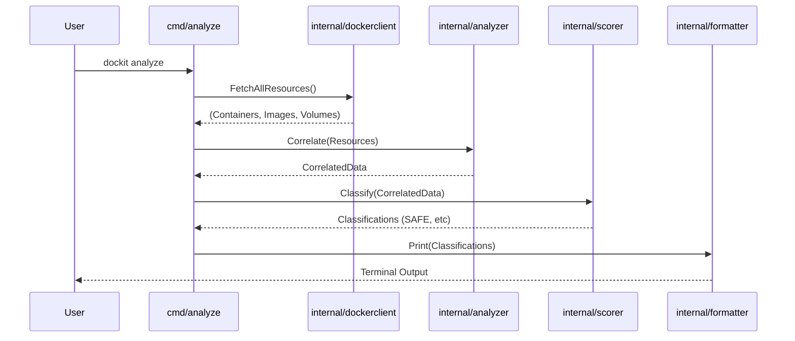

# System Architecture: dockit

This document outlines the high-level architecture of `dockit`, a Docker disk analysis and cleanup CLI tool written in Go.

## 1. High-Level Overview

`dockit` follows a layered, modular architecture. It heavily relies on the Docker Engine API (via the official Go SDK) to fetch raw data, processes that data through domain-specific analyzers, and scores resources for safe deletion.

### Core Data Flow
1. **Input**: User invokes a CLI command (e.g., `dockit analyze`).
2. **Fetch**: The `dockerclient` package retrieves list of containers, images, volumes, and build caches.
3. **Analyze**: The `analyzer` package correlates the data (e.g., mapping images to running containers, container log sizes).
4. **Score**: The `scorer` assigns a safety classification (`SAFE`, `REVIEW`, `PROTECTED`).
5. **Format**: The `formatter` outputs the result as a human-readable table or JSON.
6. **Action (Clean)**: If `dockit clean --apply` is run, the `cleaner` takes the scored resources, asks for confirmation, and deletes `SAFE` and (optionally) `REVIEW` items.

---

## 2. Component Design

The project structure is organized to adhere to standard Go project layouts.

### `cmd/`
Handles the CLI framework (Cobra). Responsible for flag parsing, configuration loading (Viper), and bootstrapping the internal services. Contains the subcommands (`summary`, `analyze`, `clean`, `logs`, `version`).

### `internal/`
Contains the private application logic.

*   **`dockerclient/`**: Thin wrapper around the Docker Go SDK. Abstracts away pagination, context handling, and basic error wrapping. Provides unified interfaces like `ResourceFetcher`.
*   **`analyzer/`**: Business logic for deep inspection. Determines reclaimable space, analyzes log file paths, and correlates relationships (e.g., which volumes are orphaned).
*   **`scorer/`**: Implements the safety heuristics. Rules include:
    *   *PROTECTED*: Running containers, base images of running containers, attached volumes.
    *   *REVIEW*: Stopped containers (recent), dangling images with recent tags.
    *   *SAFE*: Orphaned volumes, long-stopped containers, dangling images > threshold days.
*   **`cleaner/`**: Responsible for the mutation operations. Always performs a dry-run unless strictly passed `--apply`. Handles the "double confirmation" safety check.
*   **`logger/`**: Dedicated sub-module for the `dockit logs` feature. Connects to Docker API to read log file metadata and identify excessive writers.
*   **`formatter/`**: View layer. Transforms internal models into terminal output (using tables, colors) or structural JSON for CI automation.

### `pkg/models/`
Contains the shared data structures (e.g., `ResourceScore`, `DiskSummary`, `LogAnalysis`) that pass between `internal` components and `cmd`. Exposed to `pkg` in case they need to be imported by eventual Go integrations, though mostly used internally.

---

## 3. Sequence Diagrams (Conceptual)

### `dockit analyze`

---

## 4. Key Considerations

*   **Performance**: To handle 1000+ images or 200+ containers within 5 seconds, data fetching should leverage concurrent goroutines where the Docker API allows, or bulk endpoints (like `/system/df`).
*   **Memory constraints**: Keep memory < 150MB by streaming large responses rather than loading massive log files into memory. Log analysis should rely on file stats (size on disk) rather than log content parsing where possible.
*   **Security**: The cleanup operations must be exceptionally defensive. The CLI must assume that deletion is destructive and permanent.

---
*Generated based on PRD v1.0*
